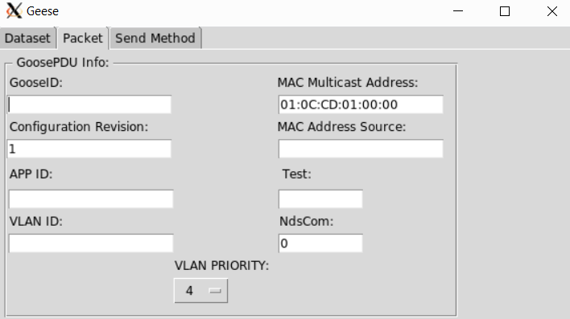

# <h1> Manuálna príručka ku GEESE generátoru
Všetky potrebné inštalácie už boli nainštalované pri spustení počiatočného skriptu. Ak tak nebolo vykonané, prosím vykonajte.
Súbor geese_final.py predstavuje používateľské rozhranie generátora premávky GEESE. Daný Python file si môžete uložiť lubovoľnom priečinku v mininete. 
Pre naše účely bol v priečinku: /home/mininet/mininet
## <h2> Podmienky spustenia generátora
* nainštalovaný Xming nástroj pri využití OS Windows
* povoliť X11 forwarding
* mať spustenú topológiu
* do topológie zadať príkaz `xterm xx` (xx predstavujú názov hosta alebo switcha)
* prejsť do priečinka, kde sa nachádza súbor geese_final.py
* cez xterm príkazový riadok spustiť príkazom: sudo `python geese_final.py` generátor trafiky.
Po poslednom príkaze sa zobrazí nasledovné používateľské rozhranie: 

Kde:
* MAC Multicast Address predstavuje cieľovú MAC Multicast adresu
* MAC Address Source predstavuje zdrojovú MAC Multicast adresu

## <h2> Literatúra
https://drive.google.com/file/d/0B0Q64CqoHFSPZVk5Z0hDSzkwZTlZa2g1cmtOSGcwMldQTllZ/view 
