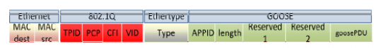
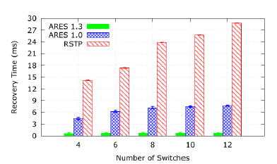
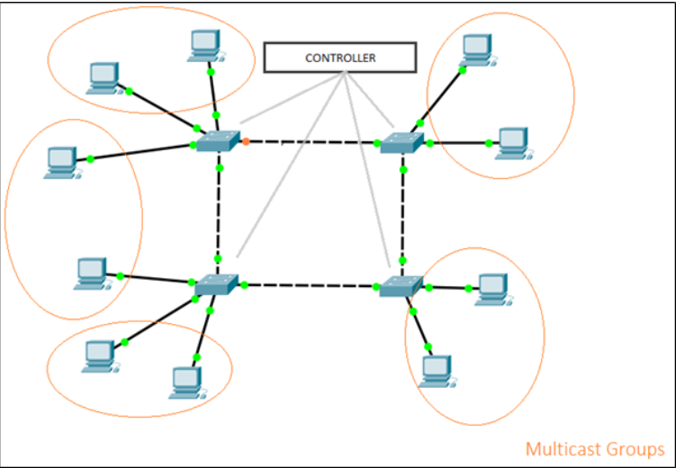
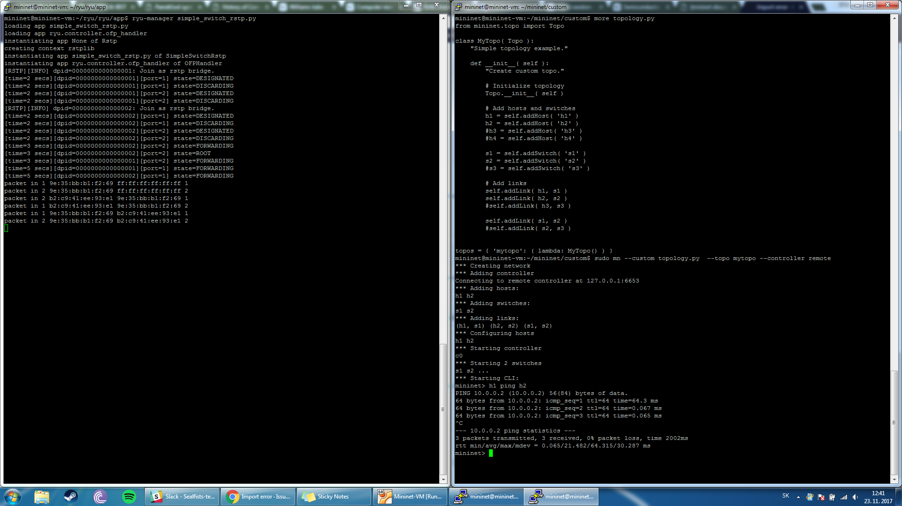

# <h1> ARES: An Autonomic and Resilient Framework for Smart Grids

## <h2> Abstrakt
V inteligentných sieťach si široké používanie distribuovaných energetických zrojov (DER) vyžaduje bezpečné a spoľahlivé riešenia,
podobné tým, ktoré sa používajú v sieťach vysokého napätia. Vstupom občasných DER zariadení, ako napríklad solárnych panelov medzi takéto siete vyžaduje taktiež viac autonómnu a dynamickú SCADA sieť. Bohužiaľ, doteraz predstavené riešenia nespĺňajú podmienky
pre tieto siete. Preto je ako riešenie predstavený framework ARES, ktorý poskytuje pružnú, robustnú a flexibilnú komunikáciu
pre inteligentné siete so softvérovo definovanými sieťami. Taktiež zahŕňa autonómne služby pre SCADA, ktoré môžu zlepšovať aplikácie
inteligentných sietí - ich výkon a efektívnosť. ARES bol testovaný pomocou Mininetu a RYU controllera, a predstavuje maximálny čas 
obnovy 610 mikrosekúnd, čo je značné vylepšenie iných, predstavených riešení. Navyše ARES je transparentný pre koncové zariadenia, 
pričom si zachováva kompatibilitu so známymi meraniami a riadiacimi zariadeniami.

## <h2> Úvod
Cieľom práce, v ktorej bol predstavený framework ARES bolo vyplniť medzeru v riešeniach pre čoraz viac sa rozširujúce inteligentné
siete, ktoré sa stávajú náhradou dnes bežných elektrických vedení, pričom sa autori chceli zamerať hlavne na bezpečnosť a spoľahlivosť 
takéhoto riešenia.

ARES teda vykonáva obnovavanie zo zlyhania (failure recovery) v reálnom čase, pričom zlyhania v sieti nahlasuje SCADA-NG, kde už 
priamo zobrazuje cestu obnovenia a konkrétne zlyhané zariadenie alebo linku. Okrem toho však automaticky identifikuje pripojené
a odpojené zariadenia, ktoré taktiež nahlasuje SCADA-NG, ktorá stojí nad týmto frameworkom. Takéto riešenie ponúka škálovateľnosť 
a jednoduchosť. Taktiež ponúka vylepšenie samostatnosti siete, vďaka automatizovanej konfigurácií zariadení, ktoré sa pripoja do siete.

Jeho najväčším príspevkom však ostáva znížený čas obnovy zo zlyhania, ktorý dosahuje len niekoľko mikrosekúnd, teda čas oveľa nižší
ako potrebuje jeden z najznámejších protokolov- RSTP.

## <h2> Analýza
Súčasťou analýzy projektu bude protokol OpenFlow, kontrolér Ryu, protokol RSTP, GEESE generátor premávky a emulačný nástroj mininet.
### <h3> OpenFlow
Pre praktické uplatnenie SDN sietí je potrebné splniť 2 požiadavky [3]:
* v sieti musí byť spoločná logická architektúra v rámci všetkých prepínačov, smerovačov a iných sieťových zariadení riadených SDN kontrolerom,
* je potrebný bezpečný protokol medzi SDN kontrolerom a sieťovými zariadeniami.

Obe tieto podmienky rieši OpenFlow, protkol medzi kontrolerom a sieťovými zariadeniami, ak aj nástroj pre špecifikáciu logickej štruktúry siete. Pracuje v rámci TCP (Transmission Control Protocol), kde počúva na porte 6653, na ktorý sa hlásia prepínače, ktoré chcú nadviazať spojenie. Vzdialené riadenie prebieha na 3. vrstve, na ktorej sa vykonávajú rôzne akcie [3]:
* pridávanie, zmena alebo vyraďovanie paketov, podľa vopred definových pravidiel a akcií
* smerovanie akceptovaných paketov prepínačom
* neakceptované pakety sú smerované do kontrolera
### <h3> Ryu kontrolér
Ryu kontroler je jeden z najznámejších a zároveň najpoužívanejších kontrolérov v SDN sieťach. Ryu je voľne síriteľný sieťový operačný systém - programovacie sieťové rozhranie (logicky centralizované), voľne dostupné pod licenciou Apache 2. [2]

Ryu poskytuje veľmi silný pomer medzi jeho výhodami a nevýhodami, v prospeh výhod. Ryu vďaka svojmu rozšíreniu a defacto štandardu kontroléra, má širokú základňu aktívnych používateľov, ktorí vytvárajú masívny zdroj informácii a spätných väzieb pre vývojárov. Taktiež je považovaný za formálny štandard pre OpenStack (voľne šíriteľný softvér pre stavanie privátnych a verejných cloudových riešení). Zároveň poskytuje konzistentnú topologizáciu na druhej vrstve OSI modelu nezávisle od tej fyzickej. [2]

Hlavné výhody Ryu sú: kvalita kódu, funkcionalita a pouziteľnosť. Podporuje niekoľko protokolov, pre správu sieťových zariadení, tými sú nap. Netconf, OF-config ale primárne OpenFlow. [2]
### <h3> RSTP protokol 
Maximálny čas, kedy konverguje STP je 50s, čo je pre praktické situácie veľmi vysoká hodnota. Preto bol vymyslený upravený algoritmus Rapid Spanning Tree Protocol (RSTP), ktorý má čas konvergencie okolo 1 az 2s. Základný princíp je podobný klasickému STP, ale je upravený pre rýchlejšiu konvergenciu pri zmene topológii. [4]
Na rozdiel od STP všetky prepínače generujú BPDU rámce a posielajú ich na všetky porty. Tiež sa definuje typ pre linky (point-to-point, edge, shared). [4] 
### <h3> GEESE generátor premávky
Generátor GEESE bol vytvorený na generovanie GOOSE premávky (využívanej v IEC 61850 komunikačných sieťach pre kontrolu a ochranu). GEESE bol navrhnutý a implementovaný s ohľadom na rôzne parametre, ktoré sú dôležité pri definovaní premávkového modelu GOOSE. [5]

Generátor bol vyvinutý pomocou Scapy (voľne dostupného softvéru pre zachytávanie paketov), pričom môže byť použitý na reálnych zariadeniach alebo v simulátoroch či emulátoroch. [5]
#### <h4> Goose
Generic Object Oriented Substation Events (GOOSE) je mechanizmus riadeného modelu, v ktorom je akýkoľvek formát údajov (stav, hodnota) zoskupený do súboru údajov a prenášaný v časovom intervale 4 milisekúnd. Údaje GOOSE sú priamo zabudované do dátových paketov Ethernet a pracujú na mechanizme vydavateľa-účastníka na multicastových alebo broadcastových MAC adresách. [7]
### <h3> Mininet
Mininet je sieťový emulátor. Umožňuje vytvárať koncové zariadenia, prepínače, smerovače a linky medzi nimi na jednom Linuxovom kernely. Mininet host sa správa rovnako ako reálna mašina a je možné sa naň pripojiť pomocou SSH. Čo sa týka OpenFlow kontrolerov, Mininet je veľmi flexibilný a umožňuje pridať do simulácie množstvo typov kontrolerov. [1]

## <h2> Návrh zadania
Článok opisuje systém ARES, ktorý má vlastný (upravený) algoritmus na opravu chýb (Failure Recovery) pri OpenFlow verzií 1.3 a 1.0. Výstupom algoritmu je, že každý prepínač pozná hlavnú a všetky záložné cesty v prípade výpadku hlavnej cesty.
V našom návrhu by sme chceli porovnať výsledky tohto algoritmu s RSTP za použitia GEESE generátora premávky a zhodnotiť zistené výsledky podľa obrázku nižšie.
V článku sú porovnané výsledky času obnovenia v ring topológii pri 4,6,8,10 a 12 prepínačoch. Pričom by sme chceli simulovať so všetkými spomínanými počtami prepínačov a zhodnotiť výsledky podľa obrázka zobrazeného nižšie.
Čas obnovy sa počítal pomocou Tfault - TNC , kde [6]:
* Tfault je čas prenosu správy z A do B počas výpadku
* TNC je čas prenosu tej istej správy ale pri normálnych podmienkach.

Návrh topológie je znázornený v obrázku nižšie. Topológia sa skladá zo 4 až 12 prepínačov (pričom budeme simulovať na 4,8 a 12 prepínačoch) a  RYU kontroléra. Dané topológie budeme simulovať v prostredí mininet. Na prepínačoch sú rovnomerne rozdelené koncové zariadenia. Každé zariadenie patrí do multicast skupiny. Celkovo je 5 rôznych multicast skupín. V prípade obrázku do jednej multicast skupiny spadajú 2 koncové zariadenia. Testovať budeme len na ring topológii z dôvodu, že RSTP je možné spúšťať len v danej topológii. 

### <h3> Testovanie:
Topológiu budeme testovať podľa článku [6], kde testovanie prebiehalo nasledovne [6]:
Generátor premávky GEESE bol spustený po stabilizácii siete. Sieťové zlyhania boli generované 60 sekúnd po začiatku emulácie (náhodné vypnutie linku pomocou linuxového príkazu). Menili sa parametre ako počet koncových zariadení, počet prepínačov a počet koncových zariadení pre multicast skupinu.

## <h2> Zhrnutie
V návrhu boli vysvetlené základné pojmy, ktoré sa vyskytujú v článku a budú sa vyskytovať aj v dokumentácií. Bolo spomenuté aj testovanie, ktoré bude súčasťou vypracovania semestrálneho zadania. 

Pre nedostatok podkladov k algoritmom využitých v ARES frameworku sme sa rozhodli vypracovať obmenené zadanie a neskôr ho porovnať s hodnotami, ktoré sú uvedené v článku - získané pomocou implementácie ARESu. Naším riešením bude implementácia RSTP, prípadne modernejšieho RSTP protokolu, ktorý otestujeme podľa vyššie spomenutej kapitoly Testovanie, na topológií z článku [6]. Taktiež plánujeme využiť GEESE, generátor sieťovej premávky, ako aj autorky článku. Chceli by sme otestovať minimálne nezaťaženú sieť (4 switche), mierne zaťaženú sieť (8 switchov) a zaťaženú sieť (12 switchov).

# <h2> Návrh

## <h3> Topológie
Topológie boli vytvorené podľa testovacích scenárov v článku, kde sa všetky experimenty vykonávali na kruhových a „mesh“ topológiách,
z ktorých sme sa rozhodli implementovať práve kruhové topológie, nakoľko nám prišlo testovanie v takomto prostredí náročnejšie, 
keďže veľa controllerov nemá podporu pre loop-handling. Je tak celkom bežné, že v takejto situácií sieť nefunguje ako má, pretože sú
všetky pakety zachytené v slučke.

Všetky topológie obsahujú 10 hostov, rozdelených do piatich rôznych multicast skupín. Počet switchov sa mení – 
4, 8 a 12 switchov. Medzi nich sme rovnomerne rozmiestnili jednotlivých hostov. 

Topológie sú implementované v skriptoch, pomocou jazyka python. Samotný súbor sa spúšťa po spustení controllera, príkazom:
* sudo python topoX.py , kde X môže nadobúdať hodnoty 1 - 3, v závislosti od topológie, ktorá sa má spustiť

Pred spustením celej topológie však ešte premazávame topológie v mininete (sudo mn -c), aby sme sa uistili, že sa v nej budú 
nachádzať len pre nás potrebné informácie a dáta. Ďalej sa pri vytváraní topológií postupuje nasledovne: 
* Vytvorenie siete s remote controllerom 
    + net = Mininet(controller=RemoteController)

* Pridanie hostov, ktorí majú definovaný názov, MAC adresu a IP adresu
    + h0 = net.addHost(&quot;h0&quot;, mac=&quot;00:00:00:00:00:01&quot;, ip=&quot;10.0.0.1/24&quot;)
    
* Pridanie switchov, ktoré majú definovaný názov, ID a protokol
    + s0 = net.addSwitch(&quot;s0&quot;,dpid=&quot;0000000000000001&quot;,protocols=&quot;OpenFlow13&quot;)

* Pridanie potrebných liniek
    + net.addLink(s0,h0)

* Pridanie controllera
    + c0 = net.addController(&quot;c0&quot;)

* Spustenie siete
    + net.start()
    
* Spustenie RSTP protokolu na jednotlivých switchoch
    + for x in range(0,4 2 ):
      + cmd = &quot;ovs-vsctl set bridge s%d rstp_enable=true&quot; % (x)
      + c0.cmd(cmd)

* Pridanie jednotlivých multicast skupín
    + cmd=&quot;ip route add 225.0.0.1 dev h0-eth0&quot;
    + h0.cmd(cmd)

* Spustenie CLI
    + CLI(net)

* Zastavenie siete
    + net.stop
    

# <h2> Implementácia

## <h3> Multicast
Pri implementácii multicastu sme využili metódu z ryu kontrolera simple_switch_igmp_13.py. Postupovali sme podľa inštrukcií v [8], keďže anglická verzia problému nejestvuje. 
Základom spustenia IGMP, ktoré by zabezpečilo multicast, je vytvorenie tzv. "querier", ktorý periodicky preposiela informácie o multicastových skupinách, ktorý sa vždy nastaví na konkrétne ID switcha. Aj z tohto dôvodu sme do topológii manuálne zadávali ID pre každý switch. Daná ryu metóda tiež nastavuje IGMP server pomocou konkrétneho portu. Preto je v topológii pre 12 switchov manuálne nastavený port ku koncovému zariadeniu. 
Na obrázku nižšie je možné vidieť vytvorenie multicast skupiny. 

## <h3> Geese
Používateľské rozhranie Geese pozostáva z viacerých povinných polí:

V záložke Packet je treba určiť:
* GooseID - string hodnota
* APP ID - integer hodnota
* VLAN ID - pre testovacie účely sa využívala hodnota 1. Je dôležité, aby odosielateľ a prijímateľ Goose paketov boli v rovnakej VLAN
* MAC Multicast Address - MAC adresa cieľovej multicast skupiny
* MAC Address Source - MAC adresa zdrojovej multicast skupiny
* test - pre testovacie účely sa využívala hodnota 1

V záložke Send Method treba určiť:
* Ratio - pre testovacie účely sa využívala hodnota 10
* Interface - cez, ktoré rozhranie sa má paket poslať. Tiež záleží aj, na ktorom zariadení bol generátor spustený (xterm) a podľa toho zistiť dostupné rozhrania a zvoliť jedno z nich. 
* stNum - počet paketov, ktoré sa majú poslať. Pre testovacie učely sa využívala hodnota 10.

Generátor, keď už raz premáva, tak nie je možné za pochodu zmeniť údaje posielania. Z tohto dôvodu je treba generátor vypnúť a znova zapnúť. Preposielanie paketov, ktoré je zobrazené nižšie na obrázku, sme zachytili cez wireshark.

Avšak, keďže ide o univerzitný projekt, používateľská príručka je veľmi strohá a nie je písaná v anglickom jazyku. [9]
## <h3> RSTP
Ako už bolo spomenuté v analýze, implementácia mala zahŕňať RSTP - Rapid Spanning Tree Protocol. Podarilo sa nám dostať k reálnej
implementácií tohto prokotolu v rámci controllera [rstp], ktorý bol vypracovaný v rámci bakalárskej práce. Pri pokuse o spustenie
tohto controllera sme však narazili na problém, kedy nám ani po konvergencií nefungovala sieť. Pri snahe o riešenie sme prišli na 
to, že RSTP je podporované až od verzie OVSswitchu 2.4 a vyššie. Avšak ani update verzie nepomohol správnej funkcionalite celej siete. 

Nakoniec sme vytvorili Issue [issue] priamo v repozitári tohto projektu. Snažili sme sa spolu vymyslieť, prečo tento protokol
nefunguje. Avšak ani po niekoľkých pokusoch o opravu sa nám nepodarilo správne rozbehnúť tento controller a preto sme sa rozhodli
implementovať RSTP na jednotlivých switchoch, teda manuálne zapnúť tento protokol pomocou príkazu spomenutého v časti Topológie. Aj
napriek tomu, že takáto implementácia nie je tak efektívna ako samotný RSTP v controlleri, z časových dôvodov sme sa rozhodli otestovať
sieť aspoň v takýchto podmienkach. 

# <h2> Testovanie a výsledky
# <h2> Záver

# <h2> Zdroje
[rstp] https://github.com/AngeloDamiani/Ryu_RSTP

[issue] https://github.com/AngeloDamiani/Ryu_RSTP/issues/1

[1] https://github.com/mininet/mininet/wiki/Introduction-to-Mininet#what

[2] http://ryu.readthedocs.io/en/latest/index.html

[3] http://archive.openflow.org/wp/learnmore/

[4] https://www.cisco.com/c/en/us/support/docs/lan-switching/spanning-tree-protocol/24062-146.html

[5] Lopes Y., et al. Geese: A traffic generator for performance and security evaluation of IEC 61850 networks, 2015

[6] Lopes Y., et al. ARES: An autonomic and resilient framework for smart grids, 2017
[7] http://univagora.ro/jour/index.php/ijccc/article/view/329 
[8] https://osrg.github.io/ryu-book/ko/html/igmp_snooping.html 
[9] https://drive.google.com/file/d/0B0Q64CqoHFSPZVk5Z0hDSzkwZTlZa2g1cmtOSGcwMldQTllZ/view 
