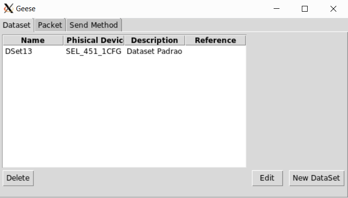

# <h1> Používateľská príručka GEESE generátora premávky
## <h2> Pre spustenie GEESE generátora premávky je potrebné spraviť
* stiahnuť súbor geese_final.py do ľubovoľného priečinka v mininete
* pomocou SSH spojenia zabezpečiť X11 forwarding
* spustiť cez SSH spojenie ľubovoľnú topológiu (mal by sa otvoriť XTerm)
* cez SSH spojenie prejsť do priečinku, v ktorom sa nachádza geese_final.py
* daný súbor spustiť príkazom  `sudo python geese_final.py`
* pri XTerm sa otvorí nové okno s používateľským rozhraním Geese generátora

