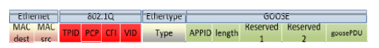
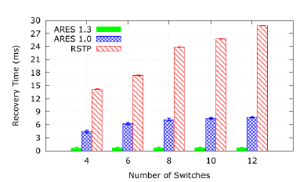
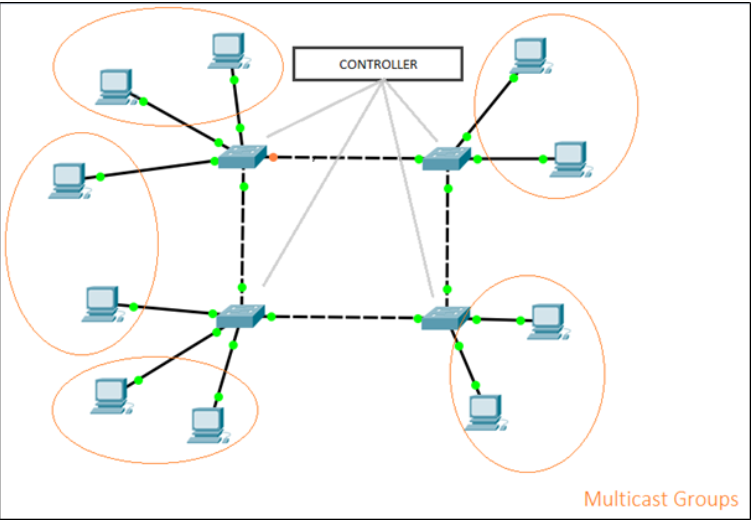

# <h1> Analýza a návrh zadania
## <h2> Analýza
Súčasťou analýzy projektu bude protokol OpenFlow, kontrolér Ryu, protokol RSTP, GEESE generátor premávky a emulačný nástroj mininet.
### <h3> OpenFlow
Pre praktické uplatnenie SDN sietí je potrebné splniť 2 požiadavky [3]:
* v sieti musí byť spoločná logická architektúra v rámci všetkých prepínačov, smerovačov a iných sieťových zariadení riadených SDN kontrolerom,
* je potrebný bezpečný protokol medzi SDN kontrolerom a sieťovými zariadeniami.

Obe tieto podmienky rieši OpenFlow, protkol medzi kontrolerom a sieťovými zariadeniami, ak aj nástroj pre špecifikáciu logickej štruktúry siete. Pracuje v rámci TCP (Transmission Control Protocol), kde počúva na porte 6653, na ktorý sa hlásia prepínače, ktoré chcú nadviazať spojenie. Vzdialené riadenie prebieha na 3. vrstve, na ktorej sa vykonávajú rôzne akcie [3]:
* pridávanie, zmena alebo vyraďovanie paketov, podľa vopred definových pravidiel a akcií
* smerovanie akceptovaných paketov prepínačom
* neakceptované pakety sú smerované do kontrolera
### <h3> Ryu kontrolér
Ryu kontroler je jeden z najznámejších a zároveň najpoužívanejších kontrolérov v SDN sieťach. Ryu je voľne síriteľný sieťový operačný systém - programovacie sieťové rozhranie (logicky centralizované), voľne dostupné pod licenciou Apache 2. [2]

Ryu poskytuje veľmi silný pomer medzi jeho výhodami a nevýhodami, v prospeh výhod. Ryu vďaka svojmu rozšíreniu a defacto štandardu kontroléra, má širokú základňu aktívnych používateľov, ktorí vytvárajú masívny zdroj informácii a spätných väzieb pre vývojárov. Taktiež je považovaný za formálny štandard pre OpenStack (voľne šíriteľný softvér pre stavanie privátnych a verejných cloudových riešení). Zároveň poskytuje konzistentnú topologizáciu na druhej vrstve OSI modelu nezávisle od tej fyzickej. [2]

Hlavné výhody Ryu sú: kvalita kódu, funkcionalita a pouziteľnosť. Podporuje niekoľko protokolov, pre správu sieťových zariadení, tými sú nap. Netconf, OF-config ale primárne OpenFlow. [2]
### <h3> RSTP protokol 
Maximálny čas, kedy konverguje STP je 50s, čo je pre praktické situácie veľmi vysoká hodnota. Preto bol vymyslený upravený algoritmus Rapid Spanning Tree Protocol (RSTP), ktorý má čas konvergencie okolo 1 az 2s. Základný princíp je podobný klasickému STP, ale je upravený pre rýchlejšiu konvergenciu pri zmene topológii. [4]
Na rozdiel od STP všetky prepínače generujú BPDU rámce a posielajú ich na všetky porty. Tiež sa definuje typ pre linky (point-to-point, edge, shared). [4] 
### <h3> GEESE generátor premávky
Generátor GEESE bol vytvorený na generovanie GOOSE premávky (využívanej v IEC 61850 komunikačných sieťach pre kontrolu a ochranu). GEESE bol navrhnutý a implementovaný s ohľadom na rôzne parametre, ktoré sú dôležité pri definovaní premávkového modelu GOOSE. [5]

Generátor bol vyvinutý pomocou Scapy (voľne dostupného softvéru pre zachytávanie paketov), pričom môže byť použitý na reálnych zariadeniach alebo v simulátoroch či emulátoroch. [5]
### <h3> Mininet
Mininet je sieťový emulátor. Umožňuje vytvárať koncové zariadenia, prepínače, smerovače a linky medzi nimi na jednom Linuxovom kernely. Mininet host sa správa rovnako ako reálna mašina a je možné sa naň pripojiť pomocou SSH. Čo sa týka OpenFlow kontrolerov, Mininet je veľmi flexibilný a umožňuje pridať do simulácie množstvo typov kontrolerov. [1]

## <h2> Návrh zadania
Článok opisuje systém ARES, ktorý má vlastný (upravený) algoritmus na opravu chýb (Failure Recovery) pri OpenFlow verzií 1.3 a 1.0. Výstupom algoritmu je, že každý prepínač pozná hlavnú a všetky záložné cesty v prípade výpadku hlavnej cesty.
V našom návrhu by sme chceli porovnať výsledky tohto algoritmu s RSTP za použitia GEESE generátora premávky a zhodnotiť zistené výsledky podľa obrázku nižšie.
V článku sú porovnané výsledky času obnovenia v ring topológii pri 4,6,8,10 a 12 prepínačoch. Pričom by sme chceli simulovať so všetkými spomínanými počtami prepínačov a zhodnotiť výsledky podľa obrázka zobrazeného nižšie.
Čas obnovy sa počítal pomocou Tfault - TNC , kde [6]:
* Tfault je čas prenosu správy z A do B počas výpadku
* TNC je čas prenosu tej istej správy ale pri normálnych podmienkach.

Návrh topológie je znázornený v obrázku nižšie. Topológia sa skladá zo 4 až 12 prepínačov (pričom budeme simulovať na 4,6,8,10 a 12 prepínačoch) a  RYU kontroléra. Dané topológie budeme simulovať v prostredí mininet. Na prepínačoch sú rovnomerne rozdelené koncové zariadenia. Každé zariadenie patrí do multicast skupiny. Celkovo je 5 rôznych multicast skupín. V prípade obrázku do jednej multicast skupiny spadajú 2 koncové zariadenia. Testovať budeme len na ring topológii z dôvodu, že RSTP je možné spúšťať len v danej topológii. 

### <h3> Testovanie:
Topológiu budeme testovať podľa článku [6], kde testovanie prebiehalo nasledovne [6]:
Generátor premávky GEESE bol spustený po stabilizácii siete. Sieťové zlyhania boli generované 60 sekúnd po začiatku emulácie (náhodné vypnutie linku pomocou linuxového príkazu). Menili sa parametre ako počet koncových zariadení, počet prepínačov a počet koncových zariadení pre multicast skupinu.

## <h2> Literatúra
[1] https://github.com/mininet/mininet/wiki/Introduction-to-Mininet#what

[2] http://ryu.readthedocs.io/en/latest/index.html

[3] http://archive.openflow.org/wp/learnmore/

[4] https://www.cisco.com/c/en/us/support/docs/lan-switching/spanning-tree-protocol/24062-146.html

[5] Lopes Y., et al. Geese: A traffic generator for performance and security evaluation of IEC 61850 networks, 2015

[6] Lopes Y., et al. ARES: An autonomic and resilient framework for smart grids, 2017
